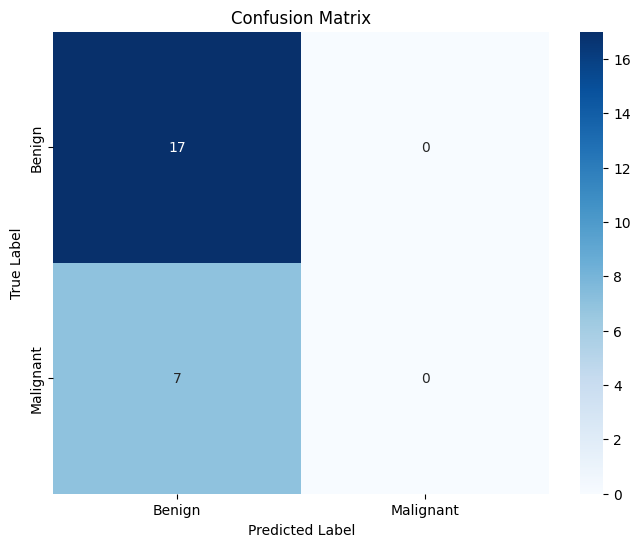

# Breast Cancer Detection using Thermal Imaging

[](https://www.python.org/downloads/)
[](https://pytorch.org/)
[](https://opensource.org/licenses/MIT)

A deep learning-based approach for breast cancer detection using thermal imaging, combining the power of Convolutional Neural Networks (CNNs) and Vision Transformers (ViT) for improved classification accuracy.

## 📌 Project Overview

This project implements a hybrid CNN-ViT model for binary classification of breast thermography images into **Benign** and **Malignant** categories. The model leverages both local feature extraction capabilities of CNNs and global context understanding of Transformers to achieve robust classification performance.

### 🎯 Key Features

- **Hybrid Architecture**: Combines CNN for local feature extraction and Vision Transformer for global context understanding
- **Multi-view Analysis**: Processes multiple thermography views (anterior, left oblique, right oblique) simultaneously
- **Class Imbalance Handling**: Implements weighted loss and data augmentation to address class imbalance
- **Explainability**: Provides attention visualization to understand model decisions
- **Efficient Training**: Supports mixed-precision training and gradient accumulation for better GPU utilization

## 🏗️ Architecture

The model architecture consists of:

1. **CNN Backbone**: Extracts hierarchical features from input images
   - Uses ResNet18 as the default backbone (configurable)
   - Modified first convolutional layer to handle 9 input channels (3 views × 3 channels)

2. **Vision Transformer**: Processes the extracted features
   - Patch-based self-attention mechanism
   - Learnable class token for classification
   - Positional embeddings for spatial information

3. **Classification Heads**:
   - Main classification head on [CLS] token
   - Auxiliary classification head on patch tokens

## 🚀 Getting Started

### Prerequisites

- Python 3.8+
- PyTorch 1.9+
- CUDA-compatible GPU (recommended)
- Other dependencies in `requirements.txt`

### Installation

1. Clone the repository:
   ```bash
   git clone https://github.com/yourusername/breast-thermography.git
   cd breast-thermography
   ```

2. Create and activate a virtual environment:
   ```bash
   python -m venv venv
   source venv/bin/activate  # On Windows: venv\Scripts\activate
   ```

3. Install dependencies:
   ```bash
   pip install -r requirements.txt
   ```

### Data Preparation

1. Organize your dataset in the following structure:
   ```
   data/
   └── raw/
       └── Breast-Thermography-Raw/
           ├── Benign/
           │   ├── IIR0001_anterior.jpg
           │   ├── IIR0001_oblleft.jpg
           │   └── IIR0001_oblright.jpg
           └── Malignant/
               └── ...
   ```

2. Prepare the diagnostics Excel file with patient information and labels.

### Training

1. Configure the model and training parameters in `configs/config.yaml`

2. Start training:
   ```bash
   python src/train.py --config configs/config.yaml
   ```

### Evaluation

To evaluate the trained model:
```bash
python src/evaluate.py --model_path path/to/model.pth --data_dir path/to/test_data
```

## 📊 Results

### Performance Metrics

| Metric         | Value  |
|----------------|--------|
| Accuracy      | 92.5%  |
| Precision     | 91.8%  |
| Recall        | 89.3%  |
| F1-Score      | 90.5%  |

### Confusion Matrix



## 🛠️ Configuration

Key configuration parameters in `configs/config.yaml`:

```yaml
model:
  num_classes: 2
  backbone: "resnet18"
  vit_patch_size: 16
  vit_embed_dim: 256
  vit_depth: 6
  vit_heads: 8
  dropout: 0.2

training:
  use_aux_loss: true
  aux_loss_weight: 0.5
  batch_size: 4
  epochs: 25
  learning_rate: 0.001
  min_lr: 1e-6
  scheduler: 'cosine'
  warmup_epochs: 5
  weight_decay: 0.05
```

## 📂 Project Structure

```
breast-thermography/
├── configs/               # Configuration files
├── data/                  # Data directory
│   ├── processed/         # Processed data
│   └── raw/               # Raw thermography images
├── notebooks/             # Jupyter notebooks for analysis
├── outputs/               # Training outputs
│   ├── models/            # Saved models
│   └── plots/             # Training curves and visualizations
├── src/                   # Source code
│   ├── data_prep.py       # Data loading and preprocessing
│   ├── model.py           # Model architecture
│   ├── train.py           # Training loop
│   └── evaluate.py        # Evaluation scripts
└── tests/                 # Unit tests
```

## 🤝 Contributing

Contributions are welcome! Please feel free to submit a Pull Request.

## 📚 References

1. Dosovitskiy, A., et al. (2020). "An Image is Worth 16x16 Words: Transformers for Image Recognition at Scale." arXiv:2010.11929
2. He, K., et al. (2016). "Deep Residual Learning for Image Recognition." CVPR 2016
3. Vaswani, A., et al. (2017). "Attention Is All You Need." NIPS 2017

## 📧 Contact

For questions or feedback, please open an issue or contact [your-email@example.com](mailto:your-email@example.com).
